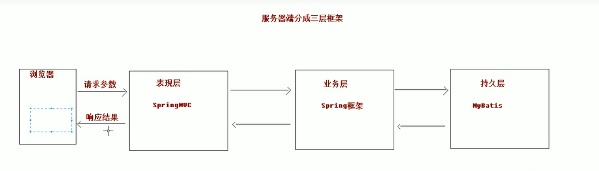
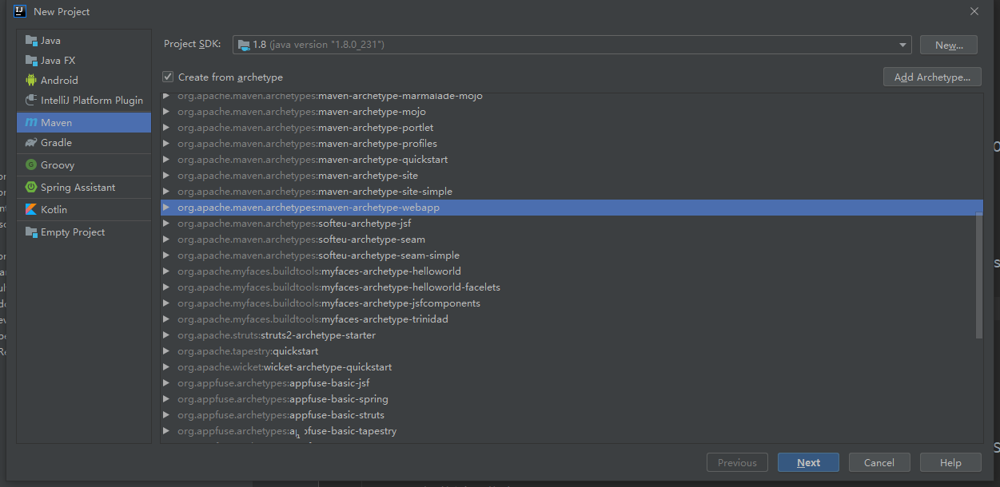
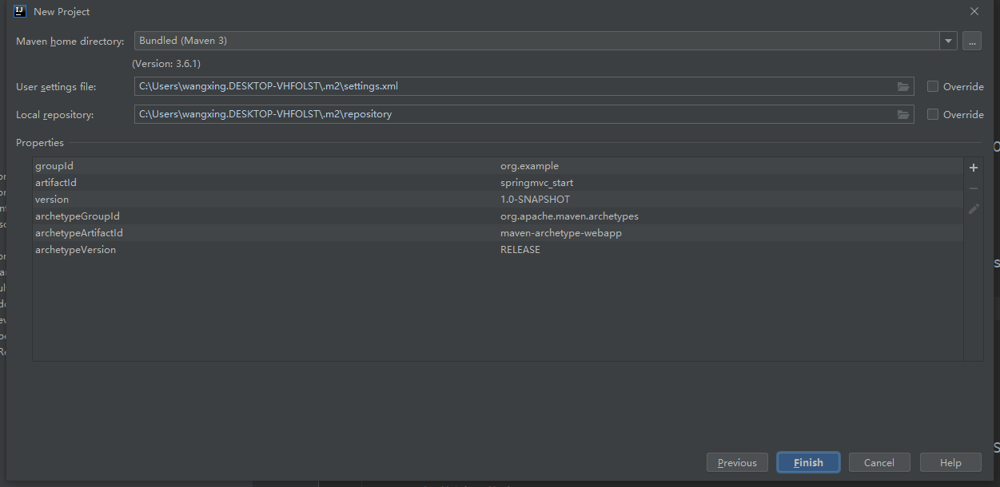
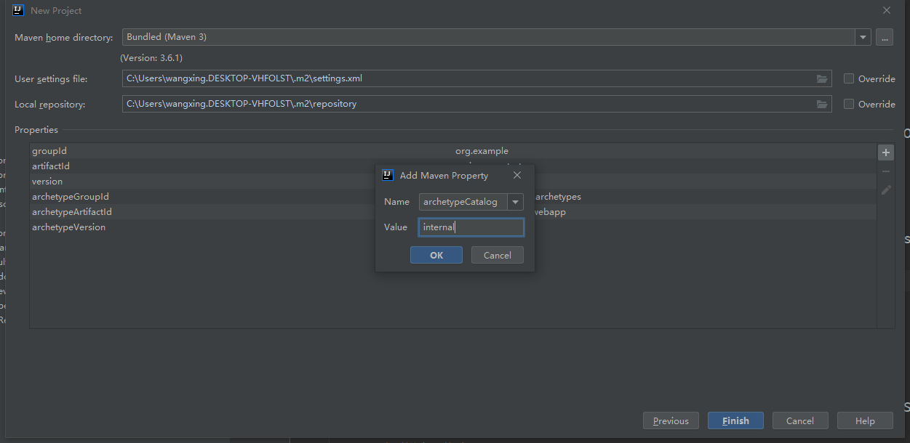
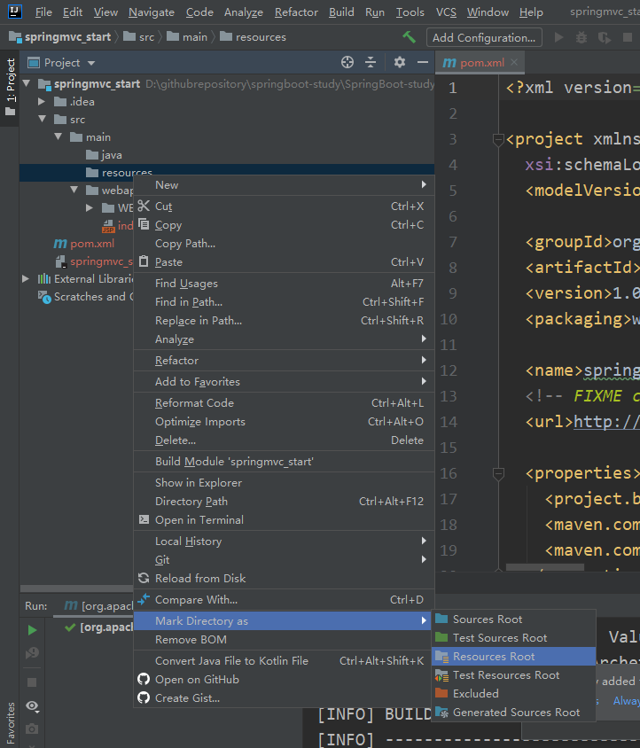
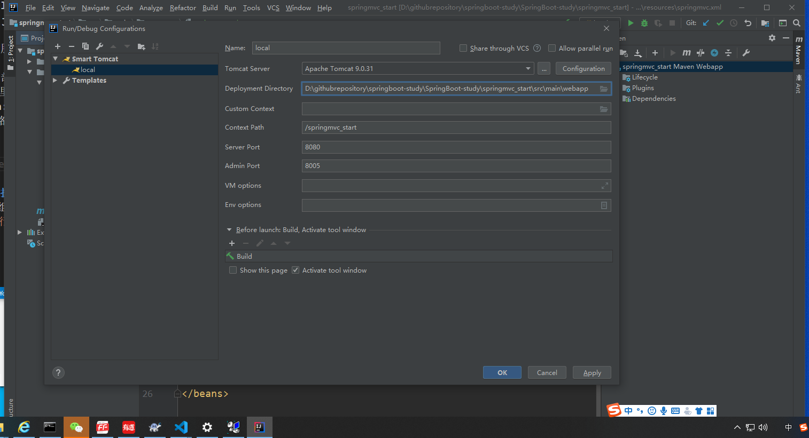
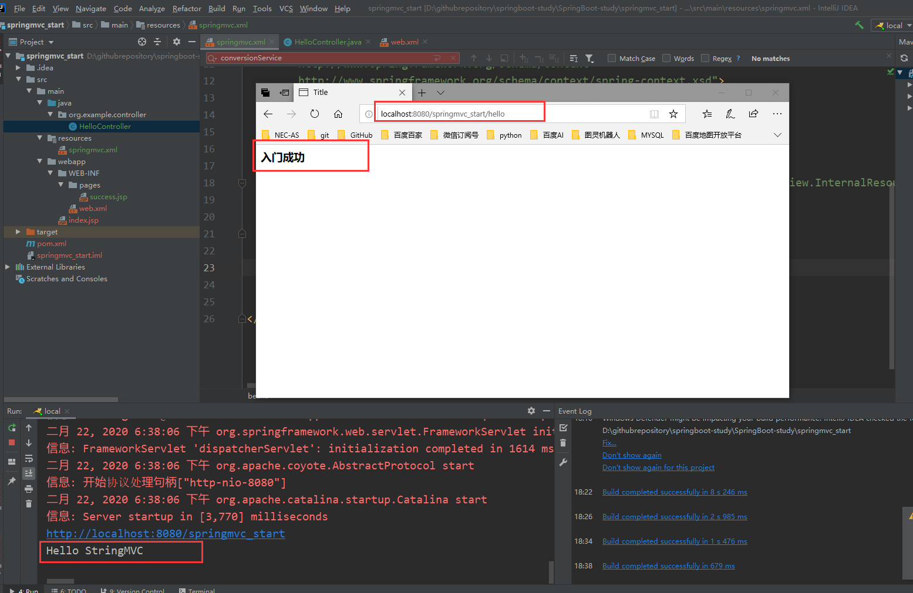
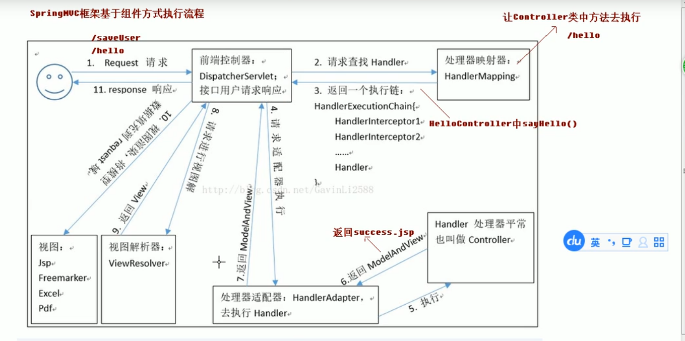

# SpringBoot-study
SpringBoot学习

## 起步
1. 安装jdk8  
2. 安装idea社区版  
3. 安装Spring Assistant插件：file->settings->plugins->Spring Assistant  
4. 创建springboot项目：New Project->Spring Assistant->...->web->spring web->...  耐心等待依赖包下载完成  

## SpringMVC回顾

### 服务器端的三层架构



### MVC模型

|        | 说明  | 备注  |
|  ----  | ----  |----  |
| M | Model模型 |JavaBean  |
| V  | View视图 |JSP  |
| C  | Controller控制器 |Servlet  |

### SpringMVC入门
1. 构建SpringMVC入门工程

   1.1 选择maven骨架


   1.2 选择maven仓库

解决maven项目创建过慢的问题：
(key=archetypeCatalog, value=internal)
 
   1.3 创建java和resource目录，并且把java目录指定为source root，resource目录指定为resource root。


2. 引入依赖的jar包
编辑pom文件
```xml
<properties>
    <project.build.sourceEncoding>UTF-8</project.build.sourceEncoding>
    <maven.compiler.source>1.8</maven.compiler.source>
    <maven.compiler.target>1.8</maven.compiler.target>
    <spring.version>5.0.2.RELEASE</spring.version>
  </properties>

  <dependencies>
    <dependency>
      <groupId>org.springframework</groupId>
      <artifactId>spring-context</artifactId>
      <version>${spring.version}</version>
    </dependency>

    <dependency>
      <groupId>org.springframework</groupId>
      <artifactId>spring-web</artifactId>
      <version>${spring.version}</version>
    </dependency>

    <dependency>
      <groupId>org.springframework</groupId>
      <artifactId>spring-webmvc</artifactId>
      <version>${spring.version}</version>
    </dependency>

    <dependency>
      <groupId>javax.servlet</groupId>
      <artifactId>servlet-api</artifactId>
      <version>2.5</version>
      <scope>provided</scope>
    </dependency>

    <dependency>
      <groupId>javax.servlet.jsp</groupId>
      <artifactId>jsp-api</artifactId>
      <version>2.0</version>
      <scope>provided</scope>
    </dependency>

  </dependencies>
```
3. 配置前端控制器 DispatcherServlet
配置webapp/WEB-INF/web.xml
```xml
<!--配置前端控制器-->
  <servlet>
    <servlet-name>dispatcherServlet</servlet-name>
    <servlet-class>org.springframework.web.servlet.DispatcherServlet</servlet-class>
    <init-param>
      <param-name>contextConfigLocation</param-name>
      <param-value>classpath:springmvc.xml</param-value>
    </init-param>
    <load-on-startup>1</load-on-startup>
  </servlet>
  <servlet-mapping>
    <servlet-name>dispatcherServlet</servlet-name>
    <url-pattern>/</url-pattern>
  </servlet-mapping>
```
3. 创建SpringMVC的配置文件
创建编辑resource/springmvc.xml
```xml
    <!-- 开启注解扫描 -->
    <context:component-scan base-package="cn.itcast"/>

    <!-- 视图解析器对象 -->
    <bean id="internalResourceViewResolver" class="org.springframework.web.servlet.view.InternalResourceViewResolver">
        <property name="prefix" value="/WEB-INF/pages/"/>
        <property name="suffix" value=".jsp"/>
    </bean>
```

5. 编写HelloController.java控制器，index.jsp和success.jsp页面

6. 部署smart tomcat服务器
  6.1、项目名称
  6.2、deployment：部署地址，注意此处需要填写的路径是源码里webapp的路径。
  6.3、Context Path: 发布的上下文，即访问url的前面的根路径（会自动识别，一般不需要修改）
  6.4、server port: tomcat访问相关的端口


7. 启动服务


### SpringMVC框架的执行流程
SpringMVC框架是基于组件化的方式执行的。

