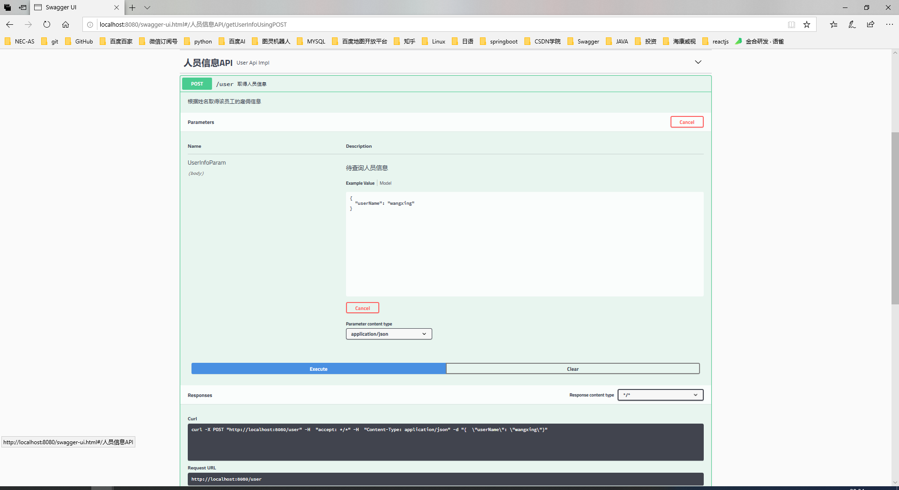

## springboot多模块 + swagger api 开发 

### springboot多模块
#### 模块构造
```
demo-server
  |
  +-- demo-api           // 微服务接口定义模块
       +--pom.xml        
  |
  +-- demo-client        // 微服务实现模块
         +--pom.xml
  |
  +-- pom.xml            // 微服务工程项目
```

#### 构建
1. 生成`demo-server`的spring boot项目工程 （选择为`spring assistant`类型，指定依赖`spring-boot-starter-web`）
2. 删除`demo-server`工程下的`src`目录
3. 右键`demo-server`工程，新规做成`module`,`demo-api`和`demo-client`（这两个module都（选择为`spring assistant`类型，指定依赖`spring-boot-starter-web`）
4. 编辑`demo-api`和`demo-client`的pom文件

### swagger

#### swagger-ui
1. http://localhost:8080/swagger-ui.html



